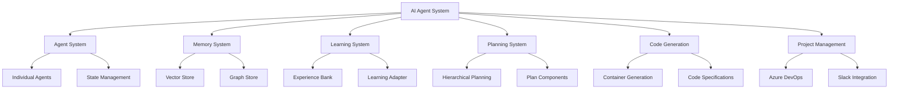
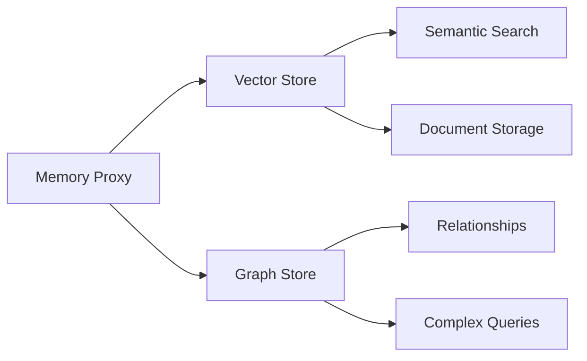

# 🤖 AI Agent System

## 📋 System Overview

This is a sophisticated multi-agent AI system designed for complex, long-running tasks with advanced learning, planning, and code generation capabilities. The system combines adaptive learning, hierarchical planning, and automated development features to handle enterprise-scale projects.

### System Architecture

### 🔧 Core Components

#### 🤖 Agent System
- **Agent**: Individual AI workers with defined roles and responsibilities
  - 🔄 Maintains its own state (idle, thinking, working, etc.)
  - ⚙️ Handles synchronous task execution
  - 💬 Manages its own conversation buffer
  - 🔌 Integrates directly with AI providers
  - 🛠️ Uses role-specific toolsets

#### 🧠 Memory System

#### Memory System
- **Dual Storage Architecture**
  - 📊 Vector Store (Qdrant)
    - Semantic search capabilities
    - Document embedding storage
    - Similarity-based retrieval
    - Configurable dimension size
  - 🕸️ Graph Store (Neo4j)
    - Relationship-based data storage
    - Complex query support
    - Transactional operations
    - Rich data modeling
    - 
- **Memory Proxy**
  - Unified interface for both storage types
  - Operation abstraction (add, search, update)
  - Automatic store selection
  - Error handling and result formatting

#### Learning System
- **Experience Bank**
  - Pattern recognition and storage
  - Success rate tracking
  - Performance metrics
  - Reliability scoring
- **Learning Adapter**
  - Strategy adaptation
  - Pattern matching
  - Performance monitoring
  - Success rate analysis

#### Planning System
- **Hierarchical Planning**
  - Goals and objectives management
  - Task decomposition
  - Resource allocation
  - Timeline management
- **Plan Components**
  - Milestones tracking
  - Dependency management
  - Critical path analysis
  - Buffer period handling

#### Code Generation System
- **Container-based Generation**
  - Isolated development environments
  - Tool integration
  - PR automation
- **Code Specifications**
  - Interface generation
  - Struct creation
  - Function implementation
  - Test generation

#### Project Management Integration
- **Azure DevOps Integration**
  - Work item management
  - Project organization
  - Progress tracking
  - Resource allocation
- **Communication (Slack)**
  - Real-time notifications
  - Stakeholder communication
  - Event handling
  - Message management

## ⭐ Key Features

### 1. 🎯 Adaptive Learning
- Pattern recognition from experiences
- Strategy optimization
- Performance metrics tracking
- Confidence-based adaptation

## 📈 Areas for Improvement

### 1. 🧮 Advanced Reasoning System
| Status | Feature              | Details                                  |
|--------|----------------------|------------------------------------------|
| ✅     | Multi-step reasoning | Implemented with validation              |
| ✅     | Meta-reasoning       | Strategy selection & resource allocation |
| 🚧     | Formal logic         | Planned improvements in theorem proving  |
| 🚧     | Uncertainty handling | Future Bayesian network implementation   |

### 2. Strategic Planning
- Multi-level goal decomposition
- Resource management
- Timeline optimization
- Progress tracking

### 3. Code Generation
- Container-based development
- PR automation
- Multiple language support
- Test generation

### 4. Project Management
- Work item tracking
- Team coordination
- Stakeholder communication
- Progress monitoring

### 5. Memory Management
- Dual storage system
- Semantic search
- Relationship mapping
- Knowledge preservation

## Areas for Improvement

### 1. Advanced Reasoning System
- **Current**: ✅ Multi-step reasoning with validation
- **Implemented**:
  - Multi-step reasoning framework
    - ✅ Premise validation
    - ✅ Logic verification
    - ✅ Confidence scoring
  - Meta-reasoning
    - ✅ Strategy selection
    - ✅ Resource allocation
    - ✅ Priority adjustment
- **Potential Improvements**:
  - Formal logic implementation
    - Extended theorem proving system with validation chains
    - Causal relationship mapping and inference
    - Temporal logic for sequence validation
    - Cross-domain reasoning bridges
  - Uncertainty handling
    - Bayesian probability networks for decision confidence
    - Multi-model uncertainty quantification
    - Dynamic confidence thresholds
    - Alternative scenario generation and evaluation
  - Advanced Meta-reasoning
    - Strategy evolution based on success patterns
    - Cross-project learning transfer
    - Auto-tuning of reasoning parameters
    - Context-aware strategy adaptation

### 2. Long-Term Planning
- **Current**: ✅ Hierarchical planning system
- **Implemented**:
  - Hierarchical planning
    - ✅ Strategic goals
    - ✅ Tactical objectives
    - ✅ Operational tasks
    - ✅ Timeline management
  - Dynamic plan adjustment
    - ✅ Progress monitoring
    - ✅ Goal reformation
    - ✅ Priority shifting
    - ✅ Resource reallocation
  - Milestone management
    - ✅ Checkpoint definition
    - ✅ Progress validation
    - ✅ Success criteria
    - ✅ Outcome measurement
- **Potential Improvements**:
  - Risk management
    - AI-driven risk identification and assessment
    - Predictive modeling for potential failures
    - Automatic contingency plan generation
    - Dynamic resource buffer calculation
  - Advanced Timeline Management
    - ML-based duration prediction
    - Dependency chain optimization
    - Critical path auto-adjustment
    - Resource contention prediction

### 3. Project Management Integration
- **Current**: ✅ Azure DevOps integration with Slack communication
- **Implemented**:
  - ✅ Work item management
  - ✅ Multi-project support
  - ✅ Real-time notifications
  - ✅ Stakeholder communication
- **Potential Improvements**:
  - Intelligent Work Item Management
    - AI-driven work item creation and classification
    - Automatic dependency detection
    - Smart assignment based on expertise and workload
    - Priority optimization using historical data
  - Advanced Project Analytics
    - Predictive progress modeling
    - Resource utilization optimization
    - Team performance analytics
    - Bottleneck prediction and mitigation
  - Stakeholder Engagement
    - Personalized communication strategies
    - Automated progress summaries
    - Impact analysis and reporting
    - Meeting facilitation and documentation

### 4. Strategic Analysis
- **Current**: Basic strategic evaluation
- **Potential Improvements**:
  - Market Intelligence
    - Automated market research and analysis
    - Competitor tracking and analysis
    - Trend prediction using ML models
    - Opportunity scoring and prioritization
  - Technology Strategy
    - Technology stack analysis and recommendations
    - Architecture evaluation and optimization
    - Scalability modeling and prediction
    - Integration opportunity identification
  - Resource Planning
    - AI-driven resource allocation
    - Cost optimization modeling
    - ROI prediction and tracking
    - Capacity planning and forecasting
  - Decision Support
    - Multi-criteria decision analysis
    - Scenario modeling and simulation
    - Risk-adjusted recommendation engine
    - Strategy impact prediction

### 5. Code Generation and Management
- **Current**: Container-based generation with PR automation
- **Implemented**:
  - ✅ Container isolation
  - ✅ PR automation
  - ✅ Code structure generation
- **Potential Improvements**:
  - Intelligent Architecture
    - Pattern-based architecture generation
    - Best practice enforcement
    - Cross-service compatibility analysis
    - Performance optimization suggestions
  - Code Quality
    - AI-driven code review
    - Security vulnerability detection
    - Performance anti-pattern detection
    - Style consistency enforcement
  - Testing Intelligence
    - Test scenario generation
    - Edge case identification
    - Integration test path generation
    - Performance test suite generation
  - Development Automation
    - Dependency management
    - Version compatibility checking
    - Breaking change detection
    - Documentation generation

### 6. Learning and Adaptation
- **Current**: ✅ Dynamic learning system
- **Implemented**:
  - Experience capture
    - ✅ Success pattern recognition
    - ✅ Performance optimization
    - ✅ Strategy refinement
  - Adaptive strategies
    - ✅ Context awareness
    - ✅ Dynamic adjustment
    - ✅ Performance tuning
    - ✅ Resource allocation
- **Potential Improvements**:
  - Advanced Pattern Recognition
    - Cross-domain pattern matching
    - Temporal pattern analysis
    - Anomaly detection and adaptation
    - Success factor identification
  - Knowledge Synthesis
    - Cross-project knowledge transfer
    - Experience-based optimization
    - Failure pattern avoidance
    - Best practice evolution

### 7. Quality Control and Metrics
- **Current**: ✅ Enhanced validation with metrics
- **Implemented**:
  - Quality metrics
    - ✅ Performance indicators
    - ✅ Success criteria
    - ✅ Error rates
    - ✅ Improvement tracking
- **Potential Improvements**:
  - Advanced Metrics
    - Predictive quality indicators
    - Cross-system performance correlation
    - Resource efficiency metrics
    - Impact assessment metrics
  - Quality Automation
    - Automated quality gates
    - Dynamic threshold adjustment
    - Continuous validation pipelines
    - Quality trend analysis
  - Process Optimization
    - Workflow efficiency analysis
    - Resource utilization optimization
    - Cost-quality balance optimization
    - Performance bottleneck identification
